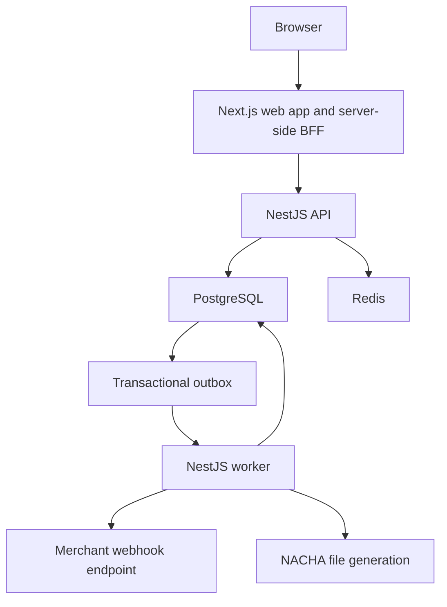

# ACHFlow

## Overview

ACHFlow is a local-first ACH payment processing platform for operating ACH debit and credit flows. It combines merchant management, payment validation, prefunded-credit reservations, lifecycle auditing, NACHA file generation, webhook delivery, and an internal operations console.

The repository contains a real NestJS API, PostgreSQL-backed worker, Next.js admin portal, Redis-backed API rate limiting, and a transactional outbox. It is designed to make payment state changes observable and safe to retry rather than treating a payment as a single synchronous request.

## Problem Statement

ACH payment systems need to handle partial failure and duplicate delivery without creating duplicate financial effects. ACHFlow addresses several practical problems:

- Safely process ACH debit and prefunded ACH credit requests.
- Prevent duplicate client requests with merchant-scoped idempotency keys.
- Keep reservations, ledger audit entries, merchant usage, and lifecycle transitions transactionally consistent.
- Isolate merchant data and prevent resource enumeration across merchants.
- Deliver lifecycle notifications with persisted outbox and webhook-delivery state.
- Give operations teams visibility into payments, ledger history, NACHA exports, webhooks, merchants, and local simulation runs.

## Features

### Payments

- ACH debit and ACH credit payment creation.
- Merchant status, direction, currency, per-payment, daily-limit, and funding-account validation.
- Merchant-scoped idempotency for payment creation.
- Lifecycle transitions for validation, submission, settlement, and return processing.
- Authenticated merchant APIs and an internal admin control plane.

### Ledger and funding

- PostgreSQL-backed funding accounts and immutable ledger entries.
- Posted balance calculated from `INITIAL_CREDIT`, `CREDIT_POSTED`, and `DEBIT_POSTED` entries using the implemented sign rules.
- Funding reservations for ACH credits, with release, settlement, and return audit entries.
- Deterministic ledger entry keys and one-reservation-per-payment database invariants.

> ACHFlow currently implements a financial audit ledger and funding-balance calculation. It does not claim to be a general-purpose double-entry accounting system.

### Operations

- Next.js operations console for dashboard, payments, ledger, NACHA files, webhooks, merchants, settings, and simulator runs.
- Read-only payment, ledger, NACHA, webhook, and health views through server-side BFF routes.
- Admin merchant provisioning, status changes, and API-key rotation.
- NACHA file generation for eligible validated ACH payments.
- Local-development transaction simulator that creates payments through the existing payment service.

### Reliability

- PostgreSQL transactional outbox with claim leases, retries, stale-claim recovery, and terminal states.
- Real worker processing for payment validation and lifecycle events.
- Redis-backed distributed payment API rate limiting.
- Encrypted-at-rest merchant webhook signing secrets using AES-256-GCM.
- Persisted webhook delivery attempts and retry state.

## Architecture



The browser never receives the internal admin key. The Next.js BFF reads it server-side and forwards authenticated control-plane requests to the NestJS API.

## Payment Lifecycle

The primary successful flow is:

```text
RECEIVED
  -> VALIDATED
  -> [ACH CREDIT reservation created]
  -> SUBMITTED (during NACHA generation)
  -> SETTLED (after bank settlement processing)
```

An ACH credit reservation is a related financial record; `RESERVED` is represented by an active `Reservation` and a `PAYMENT_RESERVED` outbox event rather than a `PaymentStatus` value.

Implemented alternatives include:

```text
RECEIVED -> VALIDATION_FAILED
SETTLED  -> RETURNED
ACTIVE reservation -> RELEASED
```

Each successful lifecycle transition records a deterministic lifecycle outbox event. Retries are designed to preserve a single reservation and a single ledger event for each deterministic entry key.

## Tech Stack

| Area            | Technology                                                                            |
| --------------- | ------------------------------------------------------------------------------------- |
| Frontend        | Next.js 15, App Router, TypeScript, Tailwind CSS, TanStack Query, next-themes, Lucide |
| API             | NestJS, TypeScript, class-validator                                                   |
| Worker          | NestJS worker, PostgreSQL advisory locks                                              |
| Database        | PostgreSQL 16, Prisma                                                                 |
| Rate limiting   | Redis 7                                                                               |
| Testing         | Jest, Vitest, Testing Library, PostgreSQL integration tests                           |
| Package manager | pnpm 11                                                                               |

## Repository Structure

```text
apps/
  api/       NestJS API, Prisma schema and migrations, admin and merchant APIs
  web/       Next.js operations console and server-side BFF routes
  worker/    Outbox processing, payment lifecycle, webhooks, NACHA generation
docs/        Domain and design notes
infrastructure/
  docker/    Local PostgreSQL and Redis Compose configuration
packages/    Shared workspace packages
```

## Getting Started

### Prerequisites

- Node.js 22 or newer
- pnpm 11 (`corepack enable` is recommended)
- Docker and Docker Compose

PostgreSQL and Redis are provided by the repository’s Compose file. A locally installed PostgreSQL or Redis instance is not required when using Docker.

### Installation

```bash
git clone https://github.com/Umesh-owl6098/achflow.git
cd achflow
pnpm install
```

### Configure local environments

Create local environment files from the examples. Do not commit them.

```bash
cp apps/api/.env.example apps/api/.env
cp apps/worker/.env.example apps/worker/.env
cp apps/web/.env.example apps/web/.env.local
```

Provide local values for the required secrets described below, then start PostgreSQL and Redis:

```bash
docker compose -f infrastructure/docker/docker-compose.yml up -d
pnpm --filter api exec prisma migrate deploy
```

Optionally seed local merchants after configuring `apps/api/.env`:

```bash
pnpm --filter api seed:merchants
```

### Start the applications

Run these in separate terminals from the repository root:

```bash
pnpm --filter api start:dev
pnpm --filter worker start:dev
pnpm web:dev
```

Default local endpoints:

| Service     | Address                        |
| ----------- | ------------------------------ |
| API         | `http://localhost:3000/api/v1` |
| Web console | `http://localhost:3001`        |
| PostgreSQL  | `localhost:5435`               |
| Redis       | `localhost:6379`               |

## Environment Variables

Use the committed `.env.example` files as the authoritative list. Keep real values in ignored local `.env` files.

| Variable                                | Used by         | Purpose                                                                         |
| --------------------------------------- | --------------- | ------------------------------------------------------------------------------- |
| `DATABASE_URL`                          | API, worker     | PostgreSQL connection string.                                                   |
| `PORT`                                  | API             | HTTP listening port.                                                            |
| `MERCHANT_API_KEY_HASH_SECRET`          | API             | HMAC secret for hashing merchant API keys at rest.                              |
| `ACHFLOW_ADMIN_API_KEY`                 | API, web server | Internal admin control-plane key. Never expose it to the browser.               |
| `REDIS_URL`                             | API             | Redis connection used for distributed rate limiting.                            |
| `PAYMENT_API_RATE_LIMIT_*`              | API             | Merchant payment API rate-limit configuration.                                  |
| `WEBHOOK_SECRET_ENCRYPTION_KEY`         | API, worker     | Base64-encoded 32-byte AES-256-GCM key for webhook signing-secret encryption.   |
| `WEBHOOK_SECRET_ENCRYPTION_KEY_VERSION` | API, worker     | Encryption-key version stored with webhook-secret envelopes.                    |
| `WEBHOOK_*`                             | API, worker     | Webhook timeout, retry, claim, batch, and worker-identity settings.             |
| `OUTBOX_*`                              | Worker          | Outbox polling, batch, retry, and claim-lease tuning.                           |
| `NEXT_PUBLIC_API_BASE_URL`              | Web             | Public base URL used by server-side BFF routes.                                 |
| `ACHFLOW_API_KEY`                       | Web server      | Merchant API key used by applicable BFF routes; never expose it in client code. |

## Running Tests and Quality Checks

The following repository commands are defined and were verified against this workspace:

```bash
# Lint all workspaces
pnpm lint

# Web TypeScript check
pnpm --filter web typecheck

# Unit/frontend workspace tests
pnpm test

# Build every workspace
pnpm build
```

App-specific commands are also available:

```bash
pnpm --filter api test
pnpm --filter worker test
pnpm --filter web test

pnpm --filter api build
pnpm --filter worker build
pnpm --filter web build
```

> At the time this README was written, `pnpm lint` reports existing unsafe-type lint errors in `apps/api/src/admin/admin-merchants.service.ts`. The command itself is valid; the README does not represent that lint run as clean.

## Security

- Merchant requests use `Authorization: Bearer <merchant-api-key>`.
- Merchant API keys are stored as HMAC hashes; plaintext merchant keys are returned only when created or rotated.
- Internal merchant-management and simulator routes require a separate `ACHFLOW_ADMIN_API_KEY` and reject merchant API keys.
- Cross-merchant payment lookups return `404` to avoid resource enumeration.
- The web console uses server-side BFF routes so browser code does not receive raw admin or merchant API keys.
- Merchant webhook signing secrets are encrypted at rest with AES-256-GCM. The UI exposes metadata, not stored plaintext secrets.
- Simulator APIs are restricted to local, development, and test environments.

## Transaction Simulator

The simulator is an internal local-development tool at `/simulator`. It generates real payment requests through `PaymentsService.create()` and therefore exercises the existing idempotency layer, transactional outbox, worker validation, ledger rules, and webhook materialization path.

| Control             | Current behavior                                                                                        |
| ------------------- | ------------------------------------------------------------------------------------------------------- |
| Eligible merchants  | One or more active merchants only.                                                                      |
| Directions          | Debit, credit, or alternating mixed traffic.                                                            |
| Limits              | Maximum 500 transactions per run and 25 TPS.                                                            |
| Runtime             | Start, pause, resume, stop, reset, run history, metrics, and recent-payment links.                      |
| Supported scenarios | Successful requests, validation failures using real merchant limits, and idempotent duplicate requests. |
| Persistence         | `SimulatorRun` records configuration, selected merchants, counters, timestamps, and failure summary.    |

The simulator deliberately does not insert payment, reservation, ledger, or outbox rows directly.

## Known Limitations

- The simulator does not yet automate NACHA submission, bank settlement callbacks, returns, insufficient-funds setup, delayed processing, or webhook fault injection. Those scenarios are rejected instead of simulated with fake data.
- The worker has no persisted heartbeat surfaced as a dedicated operational signal.
- Platform settings are primarily configuration-driven; there is no general persisted platform-settings model.
- The ledger is an audit and funding-balance ledger, not a complete general-purpose double-entry accounting subsystem.

## Future Improvements

- Persist and expose worker heartbeat information.
- Add a persisted platform-settings model with controlled administration.
- Add safe, development-only bank callback hooks for return simulation.
- Add controlled webhook fault injection for local simulator runs.
- Add inbound ACH return-file and notification-of-change processing.

## Screens

Screens are intentionally not embedded in the repository README. The local operations console includes:

- Dashboard
- Payments and payment details
- Merchants
- Ledger
- NACHA Files
- Webhooks
- Transaction Simulator
- Settings

## License

MIT
