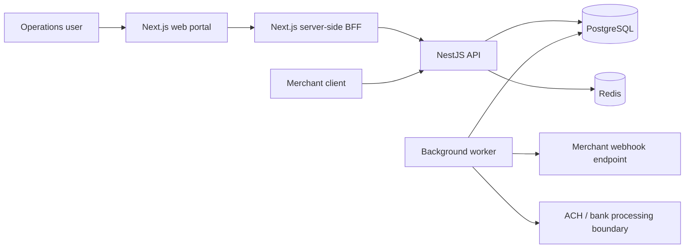
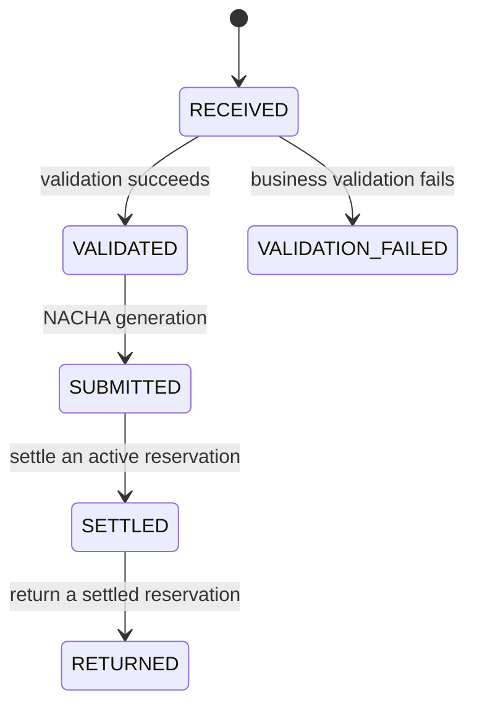
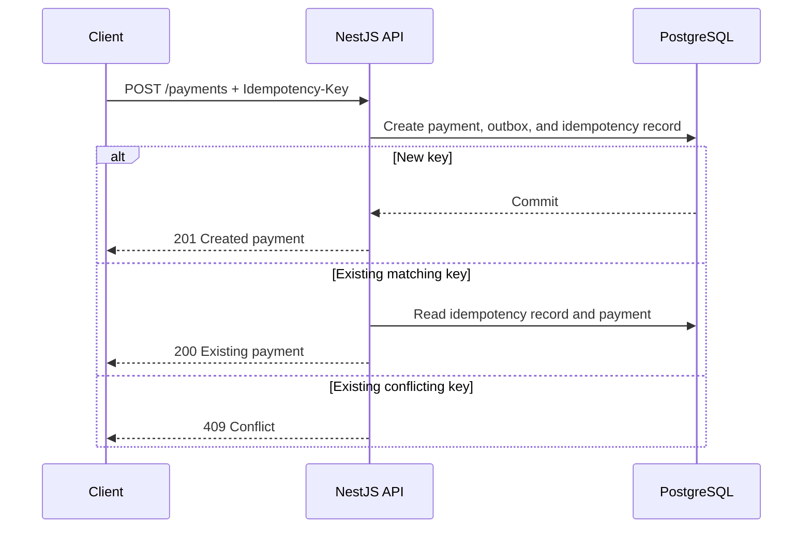
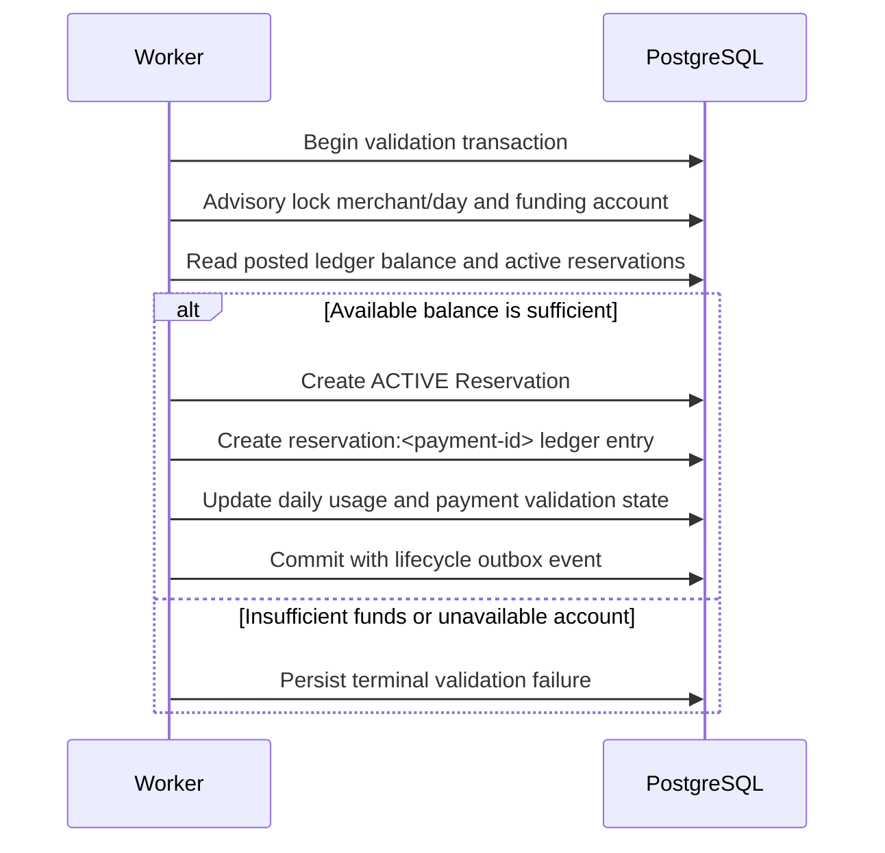
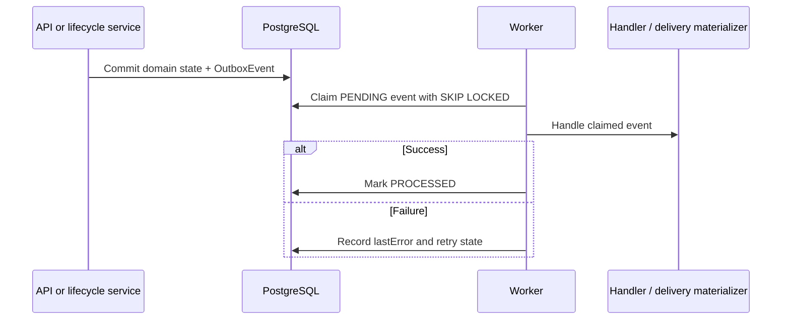
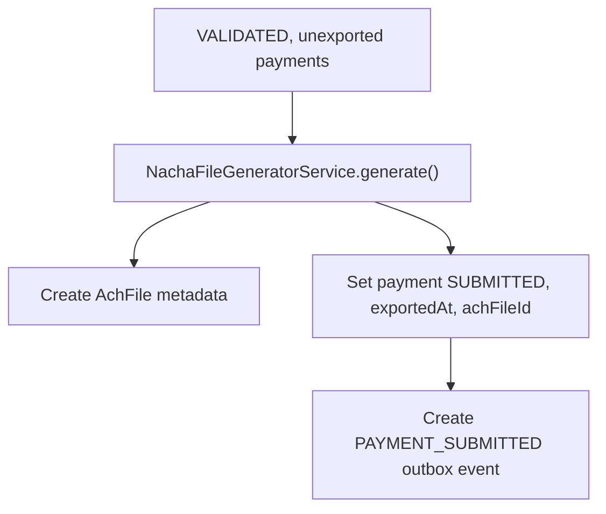
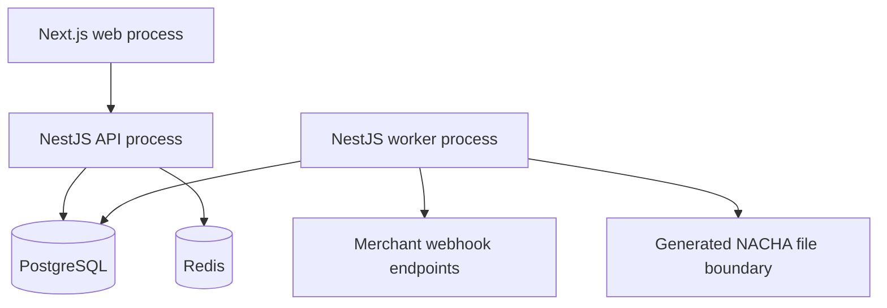

# ACHFlow Architecture

## 1. System Overview

ACHFlow is an ACH payment-processing platform with a merchant-facing payment API and an internal operations portal. It separates request handling, persistent state, and background work so a payment commit and its asynchronous follow-up work can be recovered independently.

The system includes:

- A Next.js operations portal for dashboard, payments, ledger, NACHA files, webhooks, merchants, settings, and simulator runs.
- Server-side Next.js BFF routes for browser-facing operational reads and controls.
- A NestJS API for merchant payment requests, merchant webhooks, admin controls, and system status.
- PostgreSQL for transactional state, idempotency records, lifecycle events, funding state, and operational records.
- Redis for distributed payment API rate limiting and API runtime health checks.
- A NestJS worker for outbox polling, payment validation, and provider services for webhook delivery and NACHA generation.

Keeping the web application, API, worker, PostgreSQL, and Redis separate gives the system distinct security and runtime boundaries. The browser does not receive control-plane credentials; the API owns transactional writes; the worker owns retryable background work; PostgreSQL is the source of truth; and Redis is not treated as a durable queue.

## 2. High-Level Architecture



The worker-to-bank arrow represents NACHA file generation at the repository boundary. ACHFlow does not currently implement a direct bank transport, bank API, or inbound bank file parser.

## 3. Application Components

### Next.js Web Portal

[`apps/web`](../apps/web) is a Next.js 15 App Router application. It contains the operations UI for:

- Dashboard
- Payments and payment details
- Ledger
- NACHA files
- Webhooks and delivery history
- Merchants
- Settings
- Transaction simulator

It uses typed fetch helpers and TanStack Query. Operational data is fetched through server-side BFF routes rather than by sending the admin key to the browser.

### Next.js BFF

The web application exposes internal routes under [`apps/web/app/api`](../apps/web/app/api), including `/api/admin/...`. Those routes read `ACHFLOW_ADMIN_API_KEY` on the Next.js server and proxy eligible requests to the NestJS admin API.

This protects the admin key from browser JavaScript. The BFF is a proxy boundary; it is not a second payment engine and does not duplicate payment business logic.

### NestJS API

[`apps/api`](../apps/api) provides:

- Merchant-facing payment APIs under `/api/v1/payments`.
- Merchant-scoped webhook endpoint APIs under `/api/v1/webhooks`.
- Admin merchant, system status, and simulator APIs under `/api/v1/admin`.
- Request validation through DTOs and `class-validator`.
- Merchant authentication, API-key hashing, idempotency, and payment creation.

The API creates payments transactionally with their initial outbox event and idempotency record. It also exposes direct lifecycle operations where the caller has access to the merchant-owned payment.

### PostgreSQL

The Prisma schema in [`apps/api/prisma/schema.prisma`](../apps/api/prisma/schema.prisma) persists the core state:

| Area                              | Models                                                               |
| --------------------------------- | -------------------------------------------------------------------- |
| Merchant identity and credentials | `Merchant`, `MerchantApiKey`                                         |
| Payments and deduplication        | `Payment`, `PaymentIdempotencyRecord`                                |
| Funding and audit entries         | `FundingAccount`, `LedgerEntry`, `Reservation`, `MerchantDailyUsage` |
| Bank and lifecycle events         | `ProcessedBankEvent`, `OutboxEvent`                                  |
| Webhooks                          | `MerchantWebhookEndpoint`, `WebhookDelivery`                         |
| NACHA exports                     | `AchFile`                                                            |
| Local simulation                  | `SimulatorRun`                                                       |

Database constraints are part of the correctness model. Examples include merchant-scoped idempotency uniqueness, global ledger entry-key uniqueness, one reservation per payment, and one funding account per merchant/currency.

### Redis

Redis is used by the API’s distributed rate limiter and is pinged by the admin system-status endpoint. The repository does not use Redis as a message queue or as the transactional source of truth for payment lifecycle state.

### Worker

[`apps/worker`](../apps/worker) includes:

- `OutboxPollingService`, which recovers expired claims, claims pending PostgreSQL outbox records, and records retry state.
- `OutboxHandler` and `PaymentValidationService`, which process `PAYMENT_RECEIVED` events.
- `PaymentLifecycleRepository`, which uses PostgreSQL transactions and advisory locks for financial transitions.
- `WebhookDeliveryMaterializerService` and `WebhookDeliveryProcessorService` for persisted webhook delivery work.
- `NachaFileGeneratorService` and a `generate-nacha.ts` executable for NACHA file generation.

The worker has no persisted heartbeat model. Consequently, the system-status endpoint reports worker health as `UNKNOWN` and `lastWorkerHeartbeatAt` as `null`.

## 4. Payment Lifecycle

The implemented successful credit-oriented lifecycle is:

```text
RECEIVED
  -> VALIDATED
  -> [active Reservation created for ACH CREDIT]
  -> SUBMITTED
  -> SETTLED
```

`RESERVED` is represented by `Reservation.status = ACTIVE` and a `PAYMENT_RESERVED` event. It is not a `PaymentStatus` enum value.



The `PaymentStatus` enum also contains `PENDING`, `PROCESSING`, `FAILED`, `CANCELLED`, and `UNKNOWN`. They are persisted enum values but are not normal transitions in the implemented lifecycle services.

### Lifecycle responsibilities

| Step     | Actual implementation                                                                                                                                                                                   |
| -------- | ------------------------------------------------------------------------------------------------------------------------------------------------------------------------------------------------------- |
| Create   | `PaymentsService.create()` persists `Payment`, `PaymentIdempotencyRecord`, and `PAYMENT_RECEIVED` outbox state.                                                                                         |
| Validate | The worker’s `PaymentValidationService` validates a `PAYMENT_RECEIVED` event and calls `PaymentLifecycleRepository`. Direct API validation is also available through `PaymentEngineService.validate()`. |
| Reserve  | ACH credits validate funding availability and create an `ACTIVE` `Reservation`, a `RESERVATION` ledger entry, daily usage, and `PAYMENT_RESERVED`. ACH debits do not reserve prefunded funds.           |
| Submit   | `NachaFileGeneratorService.generate()` selects eligible `VALIDATED` payments, creates an `AchFile`, sets `exportedAt` and `achFileId`, changes status to `SUBMITTED`, and creates `PAYMENT_SUBMITTED`.  |
| Settle   | `settleReservationForPayment()` requires an active reservation and `SUBMITTED` payment, then creates `SETTLEMENT` and `PAYMENT_SETTLED`.                                                                |
| Return   | `returnSettlementForPayment()` requires a settled reservation, then changes it and the payment to `RETURNED`, persists return code/time, creates `RETURN`, and emits `PAYMENT_RETURNED`.                |

## 5. ACH Debit and Credit Flows

### ACH Debit

1. A merchant sends an authenticated payment request with `Idempotency-Key`.
2. The API validates the merchant scope and persists the payment, idempotency record, and `PAYMENT_RECEIVED` event atomically.
3. The worker validates amount, USD currency, merchant status and ACH-debit permission, per-payment limit, routing/account fields, and merchant daily amount limit.
4. An ACH debit does not require a `FundingAccount`, and no prefunded reservation or `RESERVATION` ledger entry is created by the credit-reservation flow.
5. Eligible validated debits can be included in NACHA generation and receive `SUBMITTED` state and `PAYMENT_SUBMITTED` event.

The current settlement implementation requires a reservation, so it is not a complete independent debit-settlement flow. ACHFlow does not model an external bank debit posting in this repository.

### ACH Credit

1. A merchant submits an authenticated, idempotent ACH credit request.
2. Worker validation checks merchant permissions and limits.
3. In the validation transaction, ACHFlow resolves the merchant’s active funding account for the payment currency.
4. It calculates available funding as qualifying posted ledger balance minus all active reservations on that funding account.
5. When sufficient funds are available, it creates one active `Reservation`, one `RESERVATION` ledger entry, merchant daily usage, and lifecycle event state.
6. NACHA generation transitions eligible validated payments to `SUBMITTED`.
7. Settlement transitions the reservation to `SETTLED` and emits a deterministic `SETTLEMENT` entry.
8. A return transitions the settled reservation and payment to `RETURNED` and creates a `RETURN` entry.

Failed validation does not create the new reservation, reservation ledger entry, or daily usage for that payment.

## 6. Idempotency Design

Payment creation requires a non-empty `Idempotency-Key` header. The key is scoped by merchant in `PaymentIdempotencyRecord` through the unique constraint on `(merchantId, idempotencyKey)`.

The API builds a deterministic request fingerprint from the payment DTO and merchant identifier:

- A new merchant/key pair creates the payment and idempotency record in the same transaction.
- A repeated matching request returns the existing payment response.
- Reuse of a key with a different fingerprint returns `409 Conflict`.
- Concurrent uniqueness conflicts read the persisted idempotency record after a bounded visibility retry.

The local transaction simulator’s duplicate scenario uses the same `PaymentsService.create()` path and replays the same key and request.



## 7. Ledger Architecture

ACHFlow keeps an internal, append-only financial audit trail in `LedgerEntry` and uses `FundingAccount` as the basis for prefunded credit availability. Every ledger entry has a unique deterministic `entryKey`; payment-related entries also carry `paymentId`.

The posted balance calculation currently treats these entry types as follows:

| Entry type                                                            | Posted-balance contribution   |
| --------------------------------------------------------------------- | ----------------------------- |
| `INITIAL_CREDIT`, `CREDIT_POSTED`, `RETURN`, `REVERSAL`, `ADJUSTMENT` | Adds `amount`                 |
| `DEBIT_POSTED`                                                        | Subtracts `amount`            |
| `RESERVATION`, `RESERVATION_RELEASE`, `SETTLEMENT`                    | Audit-only for posted balance |

Available funding is:

```text
available = posted ledger balance - sum(ACTIVE reservation amounts)
```

ACHFlow does not currently model debit and credit account legs or balanced journal transactions. It should therefore not be described as a general double-entry accounting system. The implemented ledger supports funding availability, auditability, deterministic lifecycle entries, and payment reconciliation context.

For a generic ACH credit of `4,000` cents against a funding account with `10,000` cents posted and no active holds, ACHFlow creates `reservation:<payment-id>` for `4,000` cents. Available funding becomes `6,000` cents; the reservation entry does not itself reduce posted balance.

## 8. Reservation Flow

ACH credits reserve prefunded funds before submission so concurrent credit requests cannot oversubscribe the same funding account.



`Reservation.paymentId` is unique, preventing a second hold for the same payment. `LedgerEntry.entryKey` is also unique, preventing duplicate deterministic audit entries.

- On release, an active reservation becomes `RELEASED` and receives one `RESERVATION_RELEASE` entry.
- On settlement, it becomes `SETTLED` and receives one `SETTLEMENT` entry.
- On return, a settled reservation becomes `RETURNED`, retains the return code, and receives one `RETURN` entry.

These transitions use transactions and PostgreSQL advisory locks keyed by payment ID. They are idempotent when the target state already exists.

## 9. Outbox Pattern

When a domain transition creates a lifecycle event, it writes the state change and `OutboxEvent` in the same PostgreSQL transaction. `OutboxEvent` has persisted status, attempt, availability, claim, error, and processed timestamps.



The outbox worker claims events using `FOR UPDATE SKIP LOCKED`. It recovers expired `PROCESSING` claims, retries failures with bounded exponential delay, and eventually marks exhausted events `FAILED`.

`PAYMENT_RECEIVED` is actively handled by the current outbox handler to invoke payment validation. Other lifecycle event types are persisted for audit and webhook materialization; they are not processed as additional payment transitions by `OutboxHandler`.

## 10. Webhook Delivery Architecture

Merchants can configure `MerchantWebhookEndpoint` records through merchant-scoped webhook APIs. Endpoints store a URL and encrypted signing-secret envelope, not plaintext signing secrets. URLs are validated and webhook secrets are encrypted with AES-256-GCM.

`WebhookDeliveryMaterializerService` maps lifecycle outbox events to external event names such as `payment.created`, `payment.validated`, `payment.reserved`, `payment.submitted`, `payment.settled`, and `payment.returned`. It creates at most one delivery per `(webhookEndpointId, outboxEventId)`.

`WebhookDeliveryProcessorService`:

- Claims `PENDING` or stale `PROCESSING` deliveries in PostgreSQL with `FOR UPDATE SKIP LOCKED`.
- Decrypts the endpoint signing secret.
- Sends JSON with `X-ACHFlow-Event-Id`, `X-ACHFlow-Timestamp`, and `X-ACHFlow-Signature: v1=<HMAC-SHA256>`.
- Signs `timestamp + "." + raw JSON body`.
- Tracks `attemptCount`, response status, last error code, claim metadata, and terminal delivery state.
- Retries timeout, `408`, `429`, and `5xx` results with exponential backoff until configured maximum attempts.

The web portal includes endpoint management and delivery-history views. The worker module provides materialization and delivery processor services; this repository does not show a scheduled polling wrapper that invokes those two services automatically in the same way as `OutboxPollingService`.

## 11. NACHA File Flow

`NachaFileGeneratorService.generate()` selects `VALIDATED`, unexported debit and credit payments and groups them by direction. It constructs NACHA file header, batch header, entry detail, batch control, and file control records; calculates entry hash and debit/credit totals; pads to a ten-record block boundary; and hashes the generated file.



The generator persists `AchFile` metadata including file name, company ID, effective date, status, entry totals, debit/credit totals, entry hash, and SHA-256 checksum. The method returns the generated file content; the schema does not persist raw file content or show a storage abstraction.

Generation is available from the worker-side generator executable. Direct bank submission, bank acknowledgment, and inbound ACH return-file parsing are not implemented.

## 12. Merchant Isolation and Authentication

### Merchant authentication

Merchant APIs require `Authorization: Bearer <merchant-api-key>`. The API HMAC-hashes the supplied key with `MERCHANT_API_KEY_HASH_SECRET` and resolves `MerchantApiKey.hashedApiKey`. Payment access verifies `payment.merchantId` against the authenticated merchant; cross-merchant access returns `404`.

### Admin authentication

Admin routes require a separate `ACHFLOW_ADMIN_API_KEY`. `AdminApiKeyGuard` requires a Bearer token, compares it with `timingSafeEqual`, returns `401` for a missing header, and returns `403` for an invalid key. A merchant API key does not satisfy this guard.

### API-key rotation

Each merchant has one `MerchantApiKey` record. New or rotated raw merchant keys are returned only in the create/rotate response; list and detail responses expose only key metadata. Rotation replaces the stored HMAC hash immediately, so the prior key no longer matches.

## 13. Admin Control Plane

Admin routes under `/api/v1/admin` provide:

- Merchant list, detail, creation, status change, and API-key rotation.
- Read-only system status under `/api/v1/admin/system/status`.
- Local-development simulator controls under `/api/v1/admin/simulator`.

Platform settings are currently read-only configuration returned by the status service; there is no persisted platform-settings model. System status returns configured/not-configured flags instead of secret values and masks NACHA identification values.

## 14. Transaction Simulator Architecture

The transaction simulator persists a `SimulatorRun` with configuration, selected merchant IDs, counters, timestamps, status, latency, and failure summary. It is restricted to `local`, `development`, and `test` environments and protected by the admin guard.

The simulator:

- Selects one or more `ACTIVE` merchants only.
- Supports debit, credit, and alternating mixed traffic.
- Calls `PaymentsService.create()` for every generated payment.
- Does not insert `Payment`, `LedgerEntry`, `Reservation`, dashboard, or `OutboxEvent` records directly.
- Uses a validation-failure amount above the merchant’s configured per-payment limit.
- Reuses the same idempotency key and request for duplicate scenarios.
- Supports pause, resume, stop, run history, and recent generated payment links.
- Enforces a maximum of 500 payments per run and 25 transactions per second.

Unsupported simulator scenarios are deliberately rejected rather than faked:

- Automated ACH return processing
- Insufficient-funds injection
- Delayed-processing injection
- Webhook-failure injection

Those flows need dedicated, safe bank callback or fault-injection interfaces.

## 15. Failure Handling and Retries

| Area                        | Implemented behavior                                                                                                                  |
| --------------------------- | ------------------------------------------------------------------------------------------------------------------------------------- |
| Validation failures         | Persist `VALIDATION_FAILED` with validation/failure information and a terminal lifecycle event.                                       |
| Duplicate payment requests  | Return the original persisted payment for matching merchant/key/fingerprint; conflicting payload reuse returns `409`.                 |
| Financial transition errors | Lifecycle repository uses PostgreSQL transactions; a failed ledger insert rolls back the reservation or settlement/return transition. |
| Outbox failures             | Claimed event is returned to `PENDING` with `availableAt` retry time and safe error message, or becomes `FAILED` after max attempts.  |
| Expired outbox claims       | Recovered as `PENDING` or `FAILED` according to attempt count.                                                                        |
| Webhook failures            | Attempt is persisted; retryable network, timeout, `408`, `429`, and `5xx` failures back off; final state is `FAILED` or `DELIVERED`.  |
| Payment returns             | A settled reservation can transition once to `RETURNED`; repeat returns are idempotent.                                               |
| Simulator stop              | The run checks persisted status between generated payments and exits cleanly when stopped.                                            |

Redis rate-limiter failures are handled in the rate-limiting layer; Redis is not part of payment persistence. PostgreSQL remains the source of truth for payment and retry state.

## 16. Security Boundaries

- Merchant keys are scoped to merchants and stored as HMAC hashes.
- Admin and merchant API keys are distinct credentials.
- The admin key stays on the Next.js server side when the web portal uses BFF routes.
- Raw database URLs, Redis URLs, environment values, and existing raw merchant API keys are not returned by system-status or admin detail responses.
- Webhook signing secrets are AES-256-GCM encrypted at rest; UI views display endpoint metadata rather than plaintext secret material.
- Payment and webhook input DTOs are validated.
- Merchant status and ACH-direction permissions are evaluated during payment validation.
- Payment APIs are Redis rate limited.
- Simulator controls are unavailable outside approved local/development/test environments.

## 17. Operational Health

`GET /api/v1/admin/system/status` is admin-protected and reports:

- API status (`HEALTHY` when the endpoint responds)
- PostgreSQL health through `SELECT 1`
- Redis health through `PING`
- Pending outbox backlog
- Pending webhook delivery count
- Safe configuration flags for required environment variables
- Masked NACHA and webhook configuration metadata
- Worker status as `UNKNOWN` and no heartbeat timestamp

It does not return raw connection strings, API keys, or signing secrets.

## 18. Deployment Topology

ACHFlow is deployable as separate processes and stateful services:



The repository supplies local PostgreSQL 16 and Redis 7 through [`infrastructure/docker/docker-compose.yml`](../infrastructure/docker/docker-compose.yml). It does not contain Kubernetes manifests, cloud-provider deployment definitions, or direct production bank infrastructure.

## 19. Design Decisions

| Decision                      | Rationale in this repository                                                                         |
| ----------------------------- | ---------------------------------------------------------------------------------------------------- |
| Separate API and worker       | Keeps request handling separate from durable, retryable background event processing.                 |
| PostgreSQL as source of truth | Payment, idempotency, reservation, ledger, and outbox changes can commit transactionally.            |
| Internal funding ledger       | Computes posted and available funding independently of a bank balance query at request time.         |
| One payment model             | `PaymentDirection` distinguishes debit and credit while retaining one lifecycle model.               |
| Transactional outbox          | Prevents a committed domain change from losing its asynchronous follow-up event.                     |
| Server-side BFF               | Lets the operations portal use admin APIs without exposing the admin key.                            |
| Separate admin authentication | Keeps internal control-plane operations separate from merchant-scoped APIs.                          |
| Real-API simulator            | Exercises the actual idempotency, outbox, and worker path instead of creating fake operational data. |

## 20. Current Limitations

- No persisted platform-settings model.
- No persisted worker heartbeat.
- No direct production bank integration or bank transport.
- No inbound ACH return-file, notification-of-change, or general reconciliation-file parser.
- No safe automated bank-callback or fault-injection interface for simulator returns, NSF, delayed processing, or webhook failures.
- No raw NACHA file-content storage model or demonstrated file-download storage abstraction.
- The ledger is not a full general-purpose double-entry accounting system.
- The worker module exposes webhook materialization and delivery services, but this repository does not show a scheduled runner wiring them into the outbox polling loop.

## 21. Future Improvements

- Persist and expose worker heartbeat data.
- Add a persisted platform-settings model with controlled administration.
- Add safe development-only bank callback simulation and return-code scenarios.
- Add controlled webhook fault injection for local simulator runs.
- Add inbound ACH return-file and notification-of-change processing.
- Add reconciliation workflow tooling around `ProcessedBankEvent`.
- Add traces, structured operational metrics, and alerting.
- Integrate a stronger external secret-management provider.
- Add production deployment configuration appropriate to the target infrastructure.
